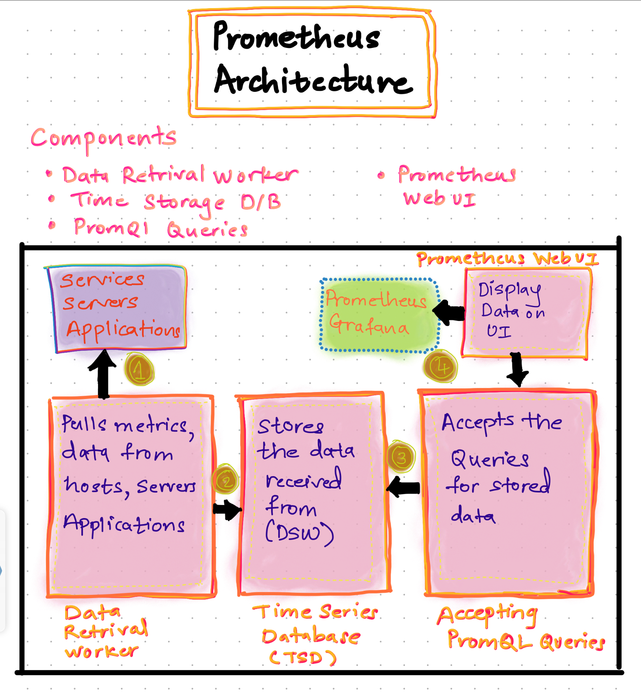

<h1> 🌵Getting started with Prometheus </h1>

 is one of the most trending tools used for monitoring of applications hosted on Kubernetes (k8s) , as its better in maintaining and monitoring of multiple servers / applications .
Also extending the functionality for "Alerting Mechanism" when working in integration with cloud native platforms like 

   

<h2> 💬 Pre-requisites </h2>
  <ol>📜 Minikube Installed </ol> 
  <ol>📜 Kubectl Installed </ol>
  <ol>🖱 Port 9090 Open </ol>
   
<h2> 🔌 Installation on Windows </h2>
  <ol> <strong>⚡OS : Windows (64-bit)</ol> </strong>
  <ol> <strong>⚡Package Manager used : Helm  </strong> </ol>

  <h2><strong> Step 1 </strong> <h1></h1>
    
            helm repo add prometheus-community https://prometheus-community.github.io/helm-charts
            helm repo update
            
     

  
  

  <h2><strong> Step 2 </strong> <h1></h1>

            helm install <Release-name> prometheus-community/prometheus 
  
            
     

   <h2><strong> Step 3 </strong> <h1></h1>

            kubectl get po
            kubectl get svc

     

       kubectl expose service prometheus-server --type=NodePort --target-port=9090 --name=prometheus-server-ext
       minikube service prometheus-server-ext

   follow the IP  that might appear on the screen / navigate to the <h3><kbd> IP Address :Port </kbd></h3> mentioned.

     

     
  
  <h2> Business cases where prometheus transformed applications </h2>
 <strong> 🖥️ Considering your application consist of multiple microservices , which are interdepenedent on each other , in some case one of your service fails , followed by which you experience 
  multiple service failure in your cluster , without <kbd>Monitoring tool</kbd> you cannot get exact insights , or supposedly you won't be able to trace down what went wrong , casuing this 
  issue
  </strong>

     

  🚥🚨 But surely with a monitoring tool like    , you will get notified, when a particular service goes down , so you can quickly trace back and fix it , with constact monitoring of metrics .

 
 </strong>

    

 <h2> 🧱 Prometheus Architecture </h2>
 
   

 Main Components of Prometheus

 <ol>🧊 Data Retrival Worker </ol>
 <ol>🧊 Time series Database </ol>
 <ol>🧊 PromQL Queries </ol>
 <ol> 🪄  Web UI  </ol>

 <h3><strong> <ol>🟢 Data Retrival Worker : Is responsible for pulling all the <kbd> metrics /data </kbd> from resources like <kbd> Server , Application </kbd> </ol>
              <ol>🟢 Time Storage Database :  For storing all data that is gathered by Data Retrival Worker </ol>
              <ol>🟢 Prom-QL queries : All the queries that are fired on database (TSW) </ol>
              <ol>🟢 WebUi  : For showcasing the results from all datasources like <kbd>Grafana / etc</kbd></strong></h3></ol>
 

  
            
  

  

  
  

  

